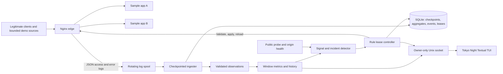
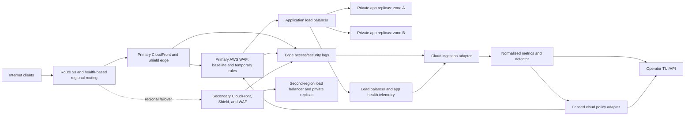

# Shield Flow DDoS protection: local demonstration and cloud architecture

Date: 2026-10-05
Status: revised design awaiting written-spec review

## Intent and scope

Build a demonstrable defensive system for the supplied 2024 Ministry of Defence / SAG, DRDO problem statement. The operator should see why traffic is considered suspicious, watch automatic protection take effect, and see service and rules recover afterward in a keyboard-driven TUI using the Tokyo Night **night** palette.

The first implementation cycle protects a new sample web app in local Docker Compose. It includes a cloud deployment architecture and runbook, but does not provision live cloud resources. Success is a repeatable, bounded localhost demonstration of application-layer attack detection, automatic mitigation, origin failover, and measured recovery. The design addresses link saturation and regional outages through the cloud reference architecture; a single Docker host cannot prove those properties.

The existing repo has a Rich/Nginx-log detector and dashboard, but no traffic enforcement. Its current working-tree edits and untracked tests/README are user work and must be preserved. The existing log-viewing entry point can continue to read legacy access logs; the new controller will use structured Nginx logs.

## System boundary



The request path is `client -> gateway -> healthy origin -> client`. The telemetry path is `gateway log -> durable spool -> ingester -> normalized observation -> metrics -> detection`. The control path is `incident -> leased rule -> Nginx validation/reload -> observed enforcement -> expiry or operator release`. Availability probes run independently of request logs, so a silent outage still appears as a failure.

Docker Compose defines the gateway, two stateless sample app replicas, and optional bounded traffic-source containers. Only the gateway publishes an HTTP port on localhost. The apps live on a private Compose network accessible to the gateway. The controller and TUI run on the host, using the existing Python environment; no container receives the Docker socket. The controller uses the local Docker Compose CLI for Nginx configuration validation/reload and for container health status. The TUI may exit while the controller continues enforcing policy.

The gateway's baseline limits continue to work if the controller stops. Nginx upstream settings retry another origin on connection failures or timeouts. Docker health checks and the controller's public `/health` probe make origin and public-service health visible; the demo records the first failed and first recovered public probe.

## Component contracts

| Component | Owns | Input | Output |
|---|---|---|---|
| Nginx gateway | Proxying, baseline limits, adaptive rules, access logs | HTTP requests and generated include files | Responses and one JSON log record per request |
| Sample app replicas | `/`, `/api`, `/health`; identical stateless responses | Proxied HTTP | Response with replica identity for failover proof |
| Log spool | Bounded retention and rename-based rotation | Nginx JSON access log and separate error log | Ordered files available for restart replay |
| Log ingestion | Follow complete lines, checkpoint, replay, parse, report freshness | Nginx JSON lines | Validated request observations or ingestion errors |
| Detection | Windows, history, evidence, risk state | Observations and public/origin health | Candidate incidents with supporting signals |
| Policy controller | Rule leases, validation, reload, rollback, reconciliation | Incidents and operator commands | Active/expired rules and audit events |
| Local control socket | Snapshot and command transport | Same-user TUI requests | JSON snapshots and command results |
| Textual TUI | Operator inspection and control | Controller snapshots | Release-rule and pause/resume commands |

The request observation schema has event time, peer/client IP, method, normalized path, status, bytes, request duration, user agent, upstream address/status, and parse provenance. Status 429/403 caused by the gateway is counted as enforcement, not an origin error. The policy decision schema has a stable rule ID, type (`source` or `endpoint`), validated subject, reason and evidence, creation/expiry times, origin (`automatic` or `operator`), and apply status. Detection never edits Nginx files directly; the policy controller is the sole writer.

The Unix socket is local, owner-only, and accepts only read-snapshot, release-rule, and pause/resume-new-actions operations. The controller persists events and active rule leases in SQLite so restart reconciliation is deterministic. It regenerates includes from unexpired leases and compares them with the gateway configuration before continuing. The TUI reads snapshots at about one-second intervals; its exit has no effect on Nginx or the controller.

## Log production and ingestion

**Format.** The gateway writes one JSON Lines record per completed request with Nginx `log_format escape=json`. The first version logs `$msec`, `$request_id`, `$remote_addr`, `$request_method`, `$uri` (path without query string), `$status`, `$request_length`, `$body_bytes_sent`, `$request_time`, `$upstream_addr`, `$upstream_status`, `$upstream_response_time`, `$http_user_agent`, and `$limit_req_status`. A generated source-rule flag distinguishes a 403 issued at the edge from an origin 403. Nginx error logs are a separate diagnostic source and are not parsed as requests. Bodies, query strings, cookies, and authorization headers are excluded. The normalizer validates IPs and numeric fields, caps display values, and strips control characters before anything reaches the TUI. Nginx provides JSON escaping and these timing/rate-limit variables. [Nginx log format](https://nginx.org/en/docs/http/ngx_http_log_module.html), [request variables](https://nginx.org/en/docs/http/ngx_http_core_module.html), [limit status](https://nginx.org/en/docs/http/ngx_http_limit_req_module.html).

**Local spool and rotation.** The gateway writes to a bind-mounted log directory, not to a transient container filesystem. The demo uses unbuffered access logging for prompt observations. The host controller rotates by renaming the active file at 10 MiB and telling Nginx to reopen it, retaining at most five previous files or 24 hours of raw logs, whichever limit is reached first. `copytruncate` is excluded because bytes could be missed at the truncation boundary. The ingester drains the old inode to EOF, then opens the new active file. On restart it scans retained files oldest to newest before following the active one. If retention has removed a file that contains unprocessed bytes, it records a permanent gap and reports degraded detection. Nginx documents the log-reopen signal used after rename. [Nginx log rotation](https://nginx.org/en/docs/control.html#logs).

**Checkpoint and replay.** The ingester tracks file identity (device and inode), byte offset after each complete newline, and the latest event time. It batches observations and commits window aggregates, recent evidence, and the offset in one SQLite transaction. A restart replays from the last committed offset; an interrupted batch is processed again only if it was never committed. Incomplete trailing lines wait for completion. Existing legacy combined-format logs remain a separate read-only monitor input; they are not silently mixed with the new JSON stream.

**Backpressure and freshness.** The in-memory batch/queue is bounded at 10,000 observations. The reader never silently discards excess requests: unread bytes remain in the spool, and the controller reports backlog bytes and the delay between log event time and processing time. If the last valid event is older than three seconds during live traffic, a file disappears, or the queue stays full, the controller marks telemetry `STALE`/`DEGRADED` and suspends new adaptive decisions until it catches up and obtains a fresh full window. Nginx baseline limits keep working. A retention gap requires an explicit recovery event and a fresh warm-up window. A malformed line increments a counter and records an escaped, truncated sample; parsing continues without letting attacker-controlled terminal escapes render.

**Operator evidence.** The controller keeps a bounded ring of the latest 200 normalized records for the local socket snapshot. The TUI Logs view shows those records with time, source, method/path, status, upstream, latency, and edge decision; it can filter by source, path, status, and edge decision and pause scrolling without pausing ingestion. Incident details link to their persisted supporting log samples. A separate Ingestion panel shows active file, offset, rows/second, parsed/skipped counts, backlog, lag, last good event, rotation count, and checkpoint age. SQLite keeps seven days of incident/action history and hourly aggregates, two hours of minute aggregates, and bounded evidence samples; raw request logs stay in the rotating spool and are purged by retention. The demo report includes persisted evidence samples and their original request IDs/offsets, so its explanation survives raw-log rotation.

## Traffic identity and trust

The local demo uses the connection peer IP for enforcement and source metrics. It does not accept an arbitrary client-supplied `X-Forwarded-For` value. Distinct demo source containers provide distinct source IPs; the legitimate probe runs separately. The gateway does not expose the app containers directly. A future cloud deployment must trust forwarded identity only from the configured CDN/load-balancer hops and restrict origin ingress to those hops. Internal-source attacks are measured at the gateway when they cross that boundary; private network and cloud security-group rules reduce direct origin bypass.

## Detection

The controller keeps 10-second and 60-second windows, two hours of minute aggregates for periodicity, and seven days of hourly aggregates for time-of-day patterns. The first 30 seconds are warm-up for a new installation; hard safety limits still apply then. A baseline is updated from normal windows only, with a minimum floor so zero traffic does not make one request anomalous. Every adaptive action requires a minimum sample and two independent signals. A single high error rate, a single IP with 100% share during low traffic, or a scheduled legitimate surge cannot alone trigger an automatic block.

The signal catalogue covers:

1. Total rate and bandwidth exceeding a normal baseline and a minimum absolute floor.
2. Per-IP and CIDR concentration/rate, including IPv6-friendly prefix handling.
3. Shared user-agent profile floods across several sources. The cloud design may add trusted geography metadata; local logs alone do not infer geolocation.
4. Endpoint request share/rate and unusual requests to one path.
5. 5xx and upstream response-time rises, treated as evidence of impact rather than proof of malice.
6. Unusual hourly volume once enough normal hourly history exists.
7. Repeated spikes with similar intervals over a longer history window.
8. Origin health and public-probe failures.

The short-window signals work live. Hour-of-day and periodicity signals stay in a learning state until sufficient history exists; deterministic timestamped fixtures verify them without pretending that a fresh one-minute deployment has a daily baseline. Initial configurable thresholds are: at least 50 requests in 10 seconds for adaptive decisions; global rate above both 15 requests/second and three times the learned baseline; source rate above 10 requests/second with at least 25% of the window; endpoint rate above 15 requests/second with at least 50% of the window and three source IPs; shared user agent above 15 requests/second from three IPs; upstream 5xx above 10% with at least 20 upstream responses; and p95 upstream time above both one second and twice the baseline. An hourly anomaly needs at least three previous observations of the same hour on separate days and volume above three times their median. A periodicity signal needs three elevated peaks in 60 minutes whose two intervals differ by no more than 20%. These are demo defaults to be tested against benign fixtures and tuned in the implementation plan, not hard-coded UI values.

## Enforcement and recovery

Nginx always applies modest per-source request and connection limits, initially 30 requests/second with a burst allowance for the local demo. Adaptive **source** rules temporarily reject only an exact source IP when its source signal agrees with global-rate or origin-impact evidence. CIDR concentration contributes evidence but does not cause a whole range to be blocked automatically. Adaptive **endpoint** rules activate a stricter, predefined 10 requests/second per-path cap only when the endpoint signal agrees with a multi-source profile or origin-impact signal; they avoid taking down the whole site. `/health` is excluded from adaptive endpoint caps so the public probe remains meaningful. The gateway returns explicit 429 responses for rate limits and records whether a response came from the edge or an origin. Operator release removes a selected adaptive rule and suppresses reapplication to that subject for 60 seconds, with the suppression visible in the TUI. Pausing automation prevents new adaptive rules, leaving existing leases and baseline limits in place.

The Nginx configuration uses a fixed per-IP limit zone, a generated `geo` include for exact blocked IPs, and a generated path-to-key `map` include for endpoint caps. An empty endpoint key is not counted by that zone; only validated selected paths are limited. These generated includes live in a bind-mounted directory. The controller owns their contents and must never interpolate a raw log value into Nginx syntax. Nginx documents that an empty limit key is not accounted. [Nginx request limiting](https://nginx.org/en/docs/http/ngx_http_limit_req_module.html).

The controller builds include files in a temporary sibling path and checks generated values against a strict IP and path grammar. It saves the current include, atomically replaces it with the candidate, runs `nginx -t` against the actual complete configuration, and requests a graceful reload only if validation passes. On failed validation it immediately restores the saved include; on failed reload it restores and reloads the saved include, recording both outcomes. Initial leases last 30 seconds. They are removed after 30 quiet seconds once their minimum lifetime has elapsed; continued evidence may extend a lease up to five minutes. The controller removes expired rules, validates/reloads, and records release time. On restart it reconciles persisted leases with the active include before taking new decisions. If reload or Docker CLI access fails, it stops issuing new adaptive actions, reports `DEGRADED`, and retains the gateway's last valid baseline configuration.

The gateway's two app origins are configured for passive failover; the controller reports Docker health and public probe results. If one replica fails, Nginx retries the other for eligible requests. When the failed replica is healthy again, it resumes receiving traffic according to the gateway's upstream behavior. Availability and rule recovery are separate measurements.

The local demo covers HTTP floods. It does not absorb network-layer floods, protect a saturated upstream link, or survive host loss. These threats require protection and capacity upstream of the origin.

## TUI

Use Textual to build a real operator console with navigable tables, detail panes, filtering, keyboard commands, and responsive layout. Use the upstream Tokyo Night **night** palette: background `#1a1b26`, recessed background `#16161e`, selection `#292e42`, primary text `#c0caf5`, muted text `#565f89`, blue `#7aa2f7`, cyan `#7dcfff`, healthy green `#9ece6a`, warning amber `#e0af68`, attack/error red `#f7768e`, and incident purple `#bb9af7`. Status always has a word or symbol alongside color. The palette comes from the theme's published night variant. [Tokyo Night palette](https://github.com/folke/tokyonight.nvim/blob/main/extras/lua/tokyonight_night.lua).

```text
 SHIELD FLOW  ● PROTECTED    18.4 r/s   Risk 42   Rules 2   Probe 99.8%
 ┌ Traffic ───────────────────┐ ┌ Detection ──────────────────────┐
 │ RPS  18.4  5xx  1.2%       │ │ IP flood          ACTIVE       │
 │ Last 60s  ▂▃▃▅█▆▃         │ │ Endpoint surge    ACTIVE       │
 │ Top: /api/search  61%      │ │ Periodic burst    LEARNING     │
 └────────────────────────────┘ └─────────────────────────────────┘
 ┌ Active rules ──────────────┐ ┌ Origins / ingestion ────────────┐
 │ > 10.0.0.8  BLOCK  00:22   │ │ app-a HEALTHY  app-b HEALTHY     │
 │   /api/search CAP  00:29   │ │ logs LIVE  lag 0.3s  backlog 0  │
 └────────────────────────────┘ └─────────────────────────────────┘
 ┌ Events and selected evidence ────────────────────────────────────┐
 │ 12:00:09 Source rule applied; nginx -t OK; 429/403 at edge       │
 └──────────────────────────────────────────────────────────────────┘
 1 Overview  2 Traffic  3 Incidents  4 Rules  5 Logs  6 System
 ? Help   / Filter   Tab Focus   j/k Move   Enter Details   u Release
 p Pause new actions   q Quit TUI
```

The Overview has the service/protection status strip, a 60-second sparkline, signal evidence, active rules, origin health, ingestion state, and latest events. Traffic shows sortable sources, CIDRs, paths, status classes, and latency. Incidents shows the timeline from first signal to mitigation and recovery, with the observations that justified each action. Rules shows type, subject, origin, activation result, remaining lease, suppression, and a release action. Logs provides the filtered request stream and a selected record's validated fields. System shows origin probes, Docker/Nginx state, log rotation/checkpoints, skipped rows, queue/backlog, and controller health. The global status remains visible on every screen.

`1`–`6` select screens, `Tab` moves focus, `j/k` moves selection, `Enter` opens details, `/` filters the focused table, `?` displays help, and `q` exits only the TUI. In Rules, `u` asks for confirmation and releases the selected rule; `p` toggles new automatic actions, with a visible persistent banner while paused. The Logs view can pause autoscroll while ingestion continues. The UI updates roughly once per second and shows a timestamp on every snapshot; if the socket disconnects, it freezes the last snapshot, labels it stale, and disables action keys. A command shows `pending` until the controller confirms Nginx validation and reload; failures remain visible in the event timeline. At widths of 120 columns or more, panels use two columns; 80–119 columns use one column; below 80 columns the compact status and screen tabs remain usable without horizontal clipping.

## Cloud deployment architecture



The reference implementation maps gateway functions to Route 53, CloudFront, Shield, AWS WAF, and an application load balancer. App replicas run in private subnets across multiple availability zones, behind load-balancer health checks and autoscaling. Origin ingress allows only the expected edge/load-balancer path. WAF rate-based and targeted rules enforce temporary policies; edge logs and application metrics feed the detection controller. The controller's cloud policy adapter uses the same decision and lease contract as the local Nginx adapter, with provider-specific propagation and rollback handling. Separate regional origins and Route 53 failover are the design response to regional or route failure; DNS caching and policy propagation mean they are not instant. Private networking, security groups, service limits, and east-west telemetry address attacks from inside the cloud boundary.

Cloud logs feed the same normalized observation contract through a provider-specific adapter with its own cursor, delivery-lag metric, and replay policy. WAF/CDN telemetry can be delayed; the edge's built-in baseline protection remains active while the controller waits for enough fresh evidence. The TUI must label cloud event time separately from arrival time and rule request time separately from confirmed propagation time. Cloud telemetry does not reuse the local three-second freshness threshold without measuring that provider's actual delivery behavior.

The cloud deliverable is an architecture diagram, component mapping, deployment/runbook steps, observability plan, and limitations. Actual AWS resources, credentials, billing, DNS ownership, and live WAF rule changes are outside this first implementation cycle. No local result will be presented as proof of volumetric or regional DDoS resilience.

## Error handling and auditability

- Malformed log lines are counted and skipped with a bounded escaped diagnostic sample; stale, missing, or gapped logs have an explicit ingestion state and cannot quietly authorize new adaptive rules.
- A full ingestion queue retains unread bytes on disk, raises backlog and lag alarms, and never reports a partial window as complete. A disk-full or rotation failure is visible as an availability risk and requires operator action before logs age out of retention.
- Invalid subjects and unsafe paths are rejected before any include is written. Nginx validation happens before activation, and the last known-good include remains recoverable.
- Every automatic and operator action records its evidence, command, validation result, activation time, expiry, and recovery result.
- A stopped controller leaves Nginx baseline limits and current valid rules intact. Restart reconciliation expires stale leases and reports mismatches.
- The public health probe is separate from traffic anomaly scoring; a failed probe raises availability status even when logs stop during an outage.

## Demonstration and acceptance

The demo traffic harness is localhost-only, rate- and duration-bounded, and names its scenario in the event stream. It does not reuse the current `test.sh` hard-coded remote target. The runbook starts Compose, the controller, and the TUI; it then demonstrates normal traffic, one high-rate source, several sources converging on an endpoint, repeated/odd-time fixture analysis, one failed origin, and cooldown/recovery. It exports a concise report with scenario, first anomalous observation, action activation, blocked/limited requests, benign probe success, public outage interval, and rule removal time.

Acceptance checks:

- Normal and moderate benign bursts produce no adaptive mitigation in deterministic tests.
- Each listed signal has deterministic positive and negative tests, including history-gated hourly and periodic patterns.
- Bounded source and distributed-endpoint scenarios activate the appropriate real Nginx rule, reduce requests reaching origins, and leave the unrelated legitimate probe available.
- Rule expiry and operator release remove the real gateway rule and appear in the event timeline.
- Stopping one sample app shows traffic served by the other; restoring it shows health recovery.
- Config validation/reload failure, missing logs, stale telemetry, and controller restart have observable and safe outcomes.
- Log rotation, controller restart mid-batch, incomplete lines, malformed JSON, backlog, retention gaps, and hostile control characters are covered by ingestion tests; the TUI displays lag and ingestion state accurately.
- The report measures detection, activation, legitimate request success, failover, and recovery times. The target for the bounded local test is detection within 15 seconds, action activation within 5 seconds after detection, at least 95% success for the unrelated legitimate probe, failover within 10 seconds, and rule removal within 35 seconds after traffic quiets. These are acceptance targets under the stated local load, not internet-scale guarantees.
- Existing tests still pass, and the TUI renders coherently at 70-, 100-, and 140-column widths using the Tokyo Night night palette. Keyboard focus, filters, stale-socket state, action confirmation, and safe log rendering are verified.

## Implementation boundaries and sequence

1. Extract reusable observations, detection, and event contracts from the current monitor without discarding its user edits.
2. Add the Compose sample app, Nginx gateway, logs, baseline limits, and origin failover.
3. Add checkpointed log ingestion, normalization, backlog/freshness metrics, and rotation/restart tests.
4. Add the host controller, rule adapter, persistence, safe reload/reconciliation, and deterministic tests.
5. Add the Tokyo Night Textual TUI, local socket controls, and viewport/keyboard verification.
6. Add bounded scenario harness, end-to-end measurements, runbook, and cloud architecture documentation.

This sequence is one local-demo implementation cycle plus a cloud design deliverable. A later cycle can implement and verify a real cloud adapter and regional deployment after the user supplies an account, domain, budget, and provider constraints.

## Technical references

- [Nginx request limiting](https://nginx.org/en/docs/http/ngx_http_limit_req_module.html)
- [Nginx JSON access logs](https://nginx.org/en/docs/http/ngx_http_log_module.html)
- [Nginx configuration reload and rollback behavior](https://nginx.org/en/docs/control.html)
- [Nginx upstream failover](https://nginx.org/en/docs/http/ngx_http_upstream_module.html)
- [Docker Compose health checks](https://docs.docker.com/compose/how-tos/startup-order/)
- [AWS DDoS resilient web architecture](https://docs.aws.amazon.com/waf/latest/developerguide/ddos-resiliency-example-web.html)
- [Route 53 health-check failover](https://docs.aws.amazon.com/Route53/latest/DeveloperGuide/dns-failover.html)
- [Tokyo Night night palette](https://github.com/folke/tokyonight.nvim/blob/main/extras/lua/tokyonight_night.lua)
